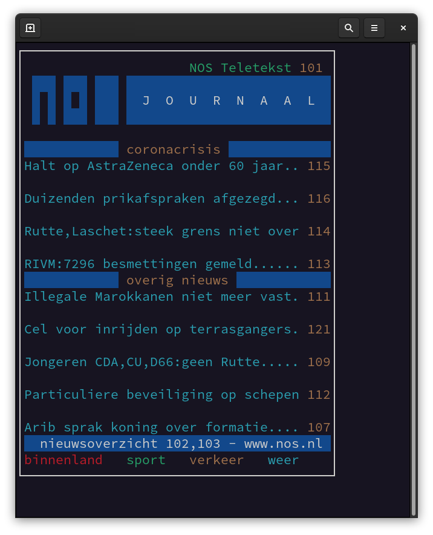
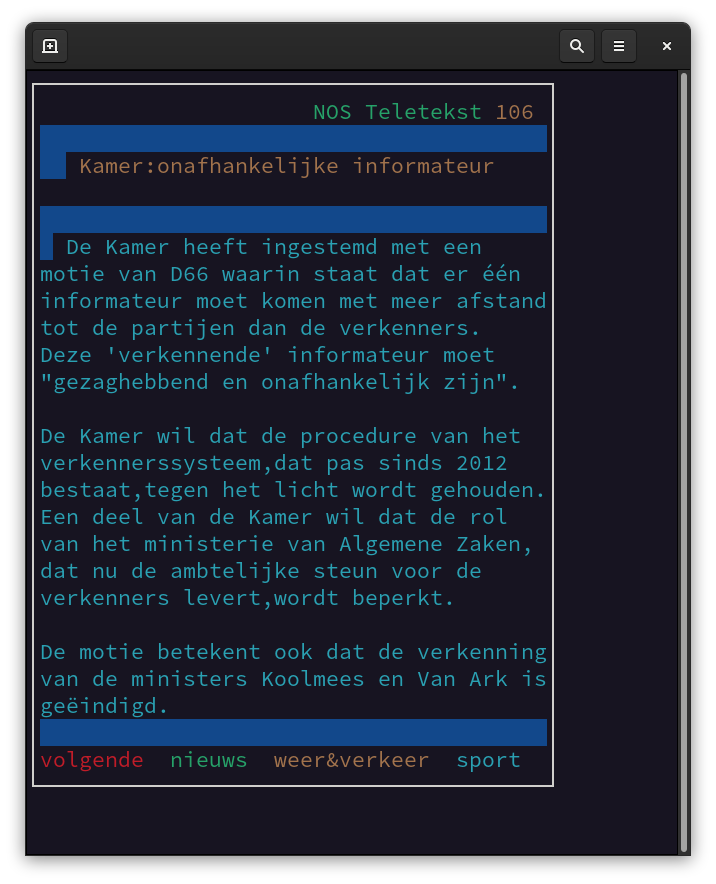
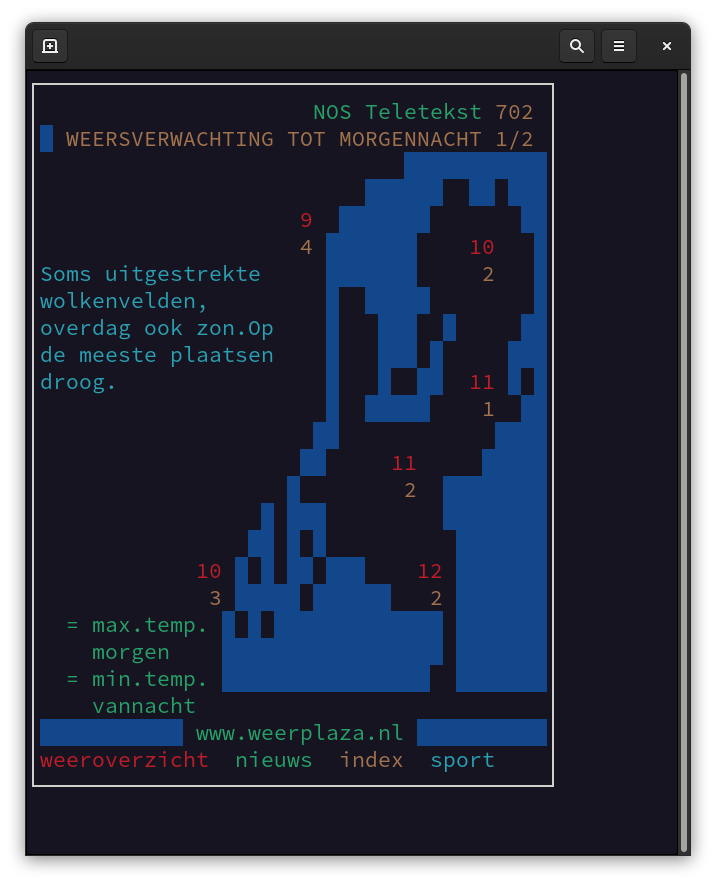

# Description

Interactive command line interface for Dutch NOS Teletekst.

# Screenshots

# Features

 - Previous/next page with left/right arrow keys
 - Type page number to go there directly (e.g. '104')
 - Press 'q' to quit to command line

Unsupported:
 - Hyperlinks
 - Subpages
 - Fast navigation to quick access pages ("binnenland", "sport", "verkeer", etc)

# Requirements & Installation

Python3 and Python modules `curses`, `requests`, and `html` are required. Installation of the `curses` package may be platform dependent.

On Linux, the program can be run with `python3 teletekst.py`.

Installation to any location can be done manually, for example with:

    sudo cp teletekst.py /usr/local/bin/teletekst
    sudo chmod +x /usr/local/bin/teletekst

After this, the program can be run with the command `teletekst`.